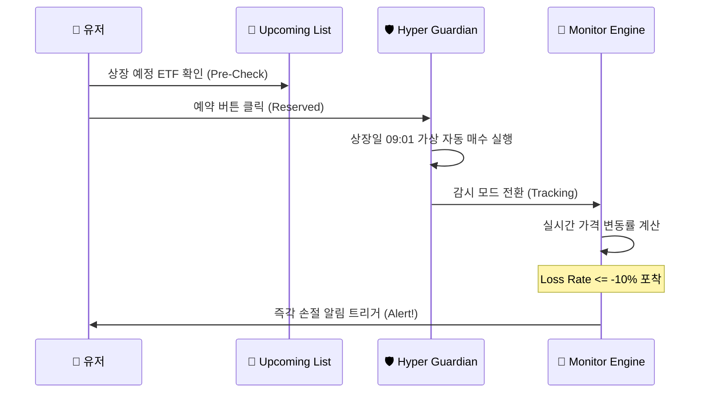

# 🛡️ Hyper ETF Guardian (하이퍼 ETF 가디언)

> **"Built in 12 Hours with AI-Workforce"**
> 
> 2월 17일 오전 제출용 ETF 손절 알림 MVP 웹사이트입니다. "No Prose, Just Precision." 원칙에 따라 군더더기 없는 데이터와 정확한 알림을 제공합니다.

## 🚀 Key Workflow (Sequence Diagram)

## 핵심 원칙
- **"No Prose, Just Precision."** (군더더기 없는 데이터와 정확한 알림)

## 폴더 구조
- `data/`: ETF 리스트 및 관련 데이터 (JSON)
- `src/`: 알림 로직 및 모니터링 소스 코드
- `assets/`: 정적 리소스 및 문서

## 기술 스택
- Python / Node.js
- FinanceDataReader
- GitHub Actions (예정)
